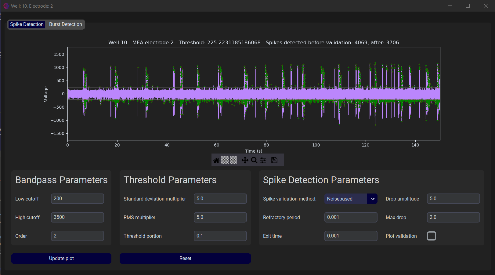
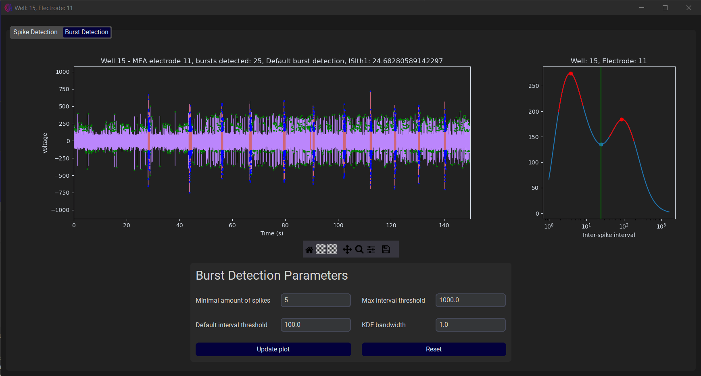

#### This project is still in development.

# MEAlytics

This repository contains a python package for analyzing Microelectrode Array (MEA) experiments.<br>
This repository is maintained by the Amsterdam University of Applied Sciences (AUMC).<br>
MEAlytics offers high speed spike, burst and network burst detection followed by feature extraction.<br>

#### For more information about the analysis or how to use the library, check out the [MEAlytics Github pages](https://cureq.github.io/CureQ/).

## Cureq
This tool was created for the CureQ consortium.<br>
For more information about the CureQ project, visit https://cureq.nl/
___

## Install the library

First, make sure you have installed a version of python on your machine, all python releases can be found here: https://www.python.org/downloads/ <br>
Secondly, make sure you have installed a package manager such as pip. <br>
Next, open a terminal and navigate to your home folder.

#### Install library with pip
Install the MEA analyzer with the following command when you are using Pip:
```shell
pip install CureQ 
```

More elaborate and simple installation instructions can be found in the user guide.<br>

#### Please not that this project is still in development. Certain aspects of the package might change in the future.

---

## Library usage
Now you can try the CureQ library functions in your Python environment. <br>
Import the function you need, call this function and watch how the pipeline analyzes your MEA file!

#### Example for analyzing all MEA wells
```python
from CureQ.mea import analyse_wells, get_default_parameters

fileadress='C:/mea_data/mea_experiment.h5'
sampling_rate=20000
electrode_amount=12

# Get and edit parameters
parameters = get_default_parameters()
parameters['use multiprocessing'] = True

if __name__ == '__main__':
    analyse_wells(fileadress=fileadress,
                  sampling_rate=sampling_rate,
                  electrode_amnt=electrode_amount,
                  parameters=parameters
                  )
```

---

## MEA GUI
Addionally, the CureQ mea library contains a graphical user interface that can be used to perform and the analysis. <br>
The GUI is also used to inspect the raw MEA data and the analysis results. Example visualisations can be found below. <br>
The GUI can be opened as follows:

#### Opening the GUI
```python
from CureQ.mea_analysis_tool import MEA_GUI

if __name__=="__main__":
    MEA_GUI()
```

#### Launch from command prompt
Additionally, he GUI can be launched from the command prompt. Simply open the command prompt, and enter “cureq”.
```shell
C:\Users>cureq
Successfully launched MEAlytics GUI
```
The output should look like this, and the GUI should appear on your screen.

#### Create shortcuts
This process can be simplified by creating shortcuts that in essence perform the same process. In the command prompt, enter “cureq –create-shortcut”.

```shell
C:\Users>cureq --create-shortcut
Desktop shortcut created at C:\Users\Desktop\CureQ.lnk
```
The output should look like this, and a shortcut should appear on your desktop:

---

## MEAlytics functionality

### Parameters
MEAlytics offers a wide range of parameters that can be used to alter the analysis! However, all parameters have default values that are backed by literature.


### MEA Analysis

MEAlytics is capable of using **multiprocessing** to make optimal use of all available resources, speeding up the analysis!


### Spike detection

After performing the analysis, the user can inspect the results using the GUI!<br>
The user can alter all parameters regarding spike, burst and network burst detection and immediately apply these changes to see how they alter the analysis. This allows you to quickly see the effect of parameter changes, without having to redo the entire analysis. <br>



Additonally, the user can zoom in on the data to view the smaller timeframes.


### Single channel burst detection

Burst detection is performed using the logISI method, meaning that the thresholds adapt to the input data!



### Network burst detection

Network burst detection is performed by looking for high activity periods on multiple channels.


### Batch processing

Perform high-throughput analysis using the batch processing module!


### Features

MEAlytics calculates over 40 descriptive well and electrode features and saves them in a csv file. These can then be read by other applications such as excel!


### Group comparison

You can combine the outcome features of multiple experiments to compare the differences between two groups using the plotting module!


Compare two groups with each other and create visualisations for all features. Output is saved in pdf format.


Visualise the development of features over time by adding a prefix to your feature files!


<!--
**CureQ/CureQ** is a ✨ _special_ ✨ repository because its `README.md` (this file) appears on your GitHub profile.
-->
