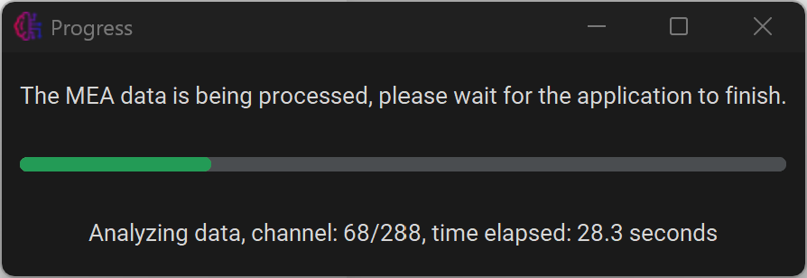

## Set parameters
First, navigate to the “Set Parameters” tab to alter analysis parameters.

<br>

From here it is possible to alter the parameters or import settings from a previous experiment. To save the parameters, press **Save parameters and return**.

**Restore default parameters** can be used to restore all parameters to the default values.

Parameters from previous experiments can be loaded using **Import parameters**. Every experiment will generate a file called ```parameters.json``` in the output folder. These files can be selected to copy the parameters to the current analysis.

For more information about each parameter, see [Parameters](parameters.html).


## Analyse file
In the main menu, select **Process single file**. 

<br>

First, press **Select a file** and select the file you want to process. Next, insert the sampling rate of the experiment, and the amount of electrode that each well contains. Then, press **Start Analysis**.

<br>
 
A new window will appear, keeping the user up to date with the progress. The analysis can be cancelled by closing this window. This might not be instant.

## Axion .raw files
Axion .raw files can unfortunately not be accessed using python, so they will first have to be converted using MATLAB using our [custom script available on GitHub](https://github.com/CureQ/CureQ/blob/main/raw_to_hdf5.m). For more information, see [Convert Axion data](axion.html).

## Rechunking
If your file has not been rechunked/compressed yet, the application will first rechunk the file, creating a rechunked copy, and then process the rechunked file. Files can also be rechunked manually. For more information about why files are rechunked, see [Compress/Rechunk files](compress_rechunk.html).
