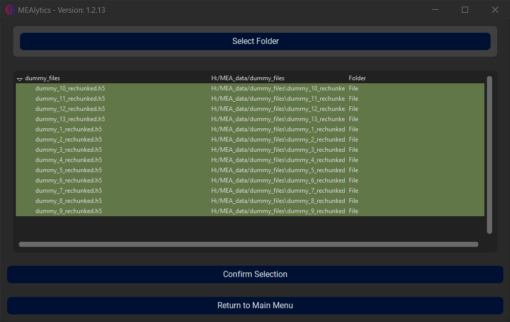
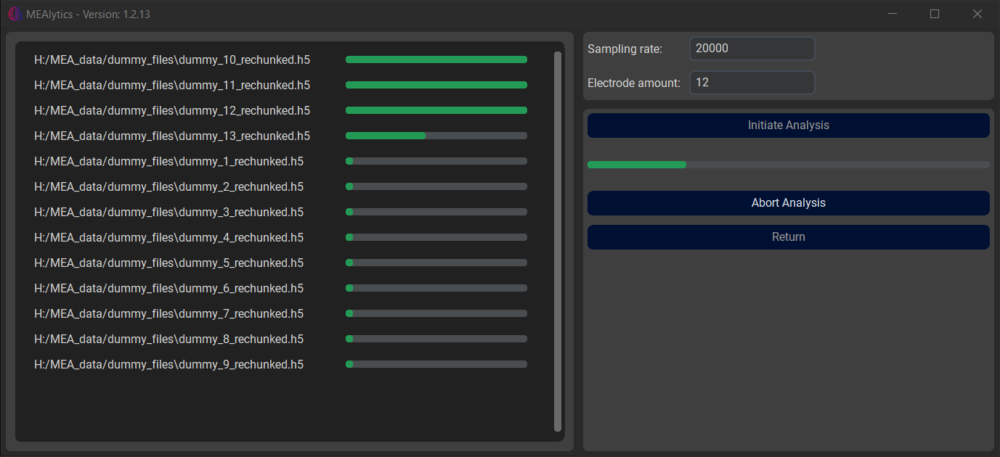

In the main menu, select **Batch Processing**. Next, press **Select Folder** and select the folder where your MEA files are located.

In this menu, the user can create a selection for the batch processing. It is possible to expand subfolders. Single files can be selected by clicking on them, the content of the entire folder can be selected by clicking the folder name. Once the selection has been made, press **Confirm Selection**.
 
Next, insert the sampling rate of all the experiments, and the amount of electrodes that each well contains. Then, press **Initiate Analysis**.

 
It is possible to cancel the analysis by pressing **Abort Analysis**. The application will finish processing the current file, after which it will quit the analysis.
