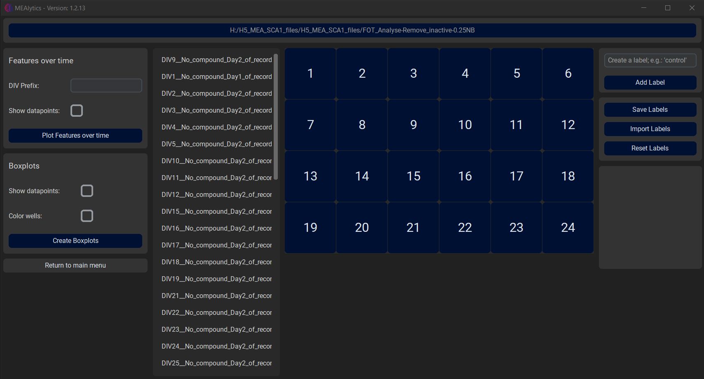
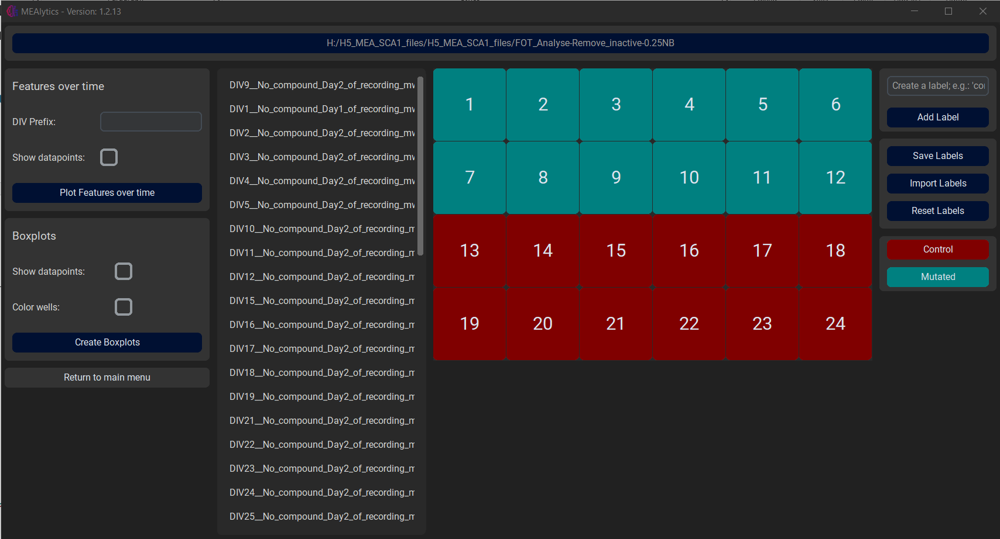
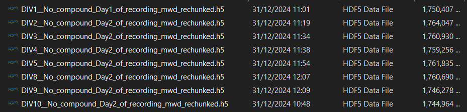
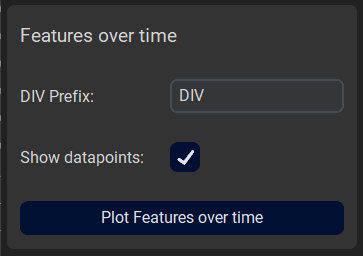
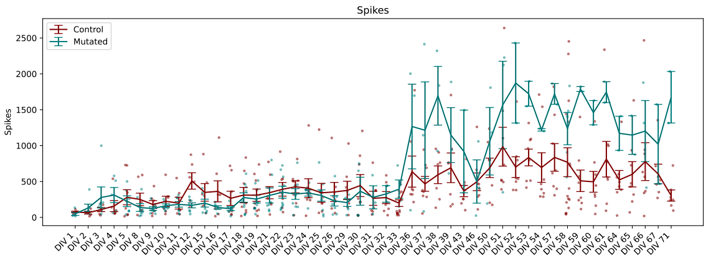
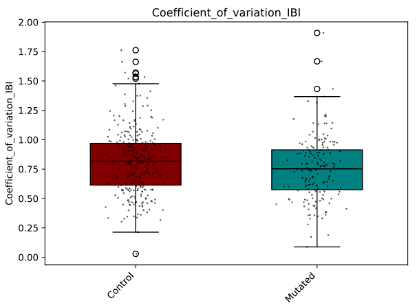

Besides functionality for analysing raw data files, this tool also provides methods to compare the outcomes of the analysis with each other.
 
In the main menu, navigate to **Plotting**.
 
At the top of the window, press Select a folder, and select the folder that contains the outputfolder(s) of your experiment(s). The application will recursively loop through all the files/folder in the directory, and look for files that end width “Features.csv”. These files will be collected for visualisation and can be seen in the second column.

 
 
In the fourth column, the user can create new labels, e.g. “Control” or “Mutated”, and assign these labels to a specific well by first selecting the label followed by the desired well.
 
 

These labels can be saved, imported or reset using the buttons on the right side of the window.

After the labels have been successfully assigned to their respective wells, there are two visualisation options, Features over time and Boxplots.

## Features over time

The Features over time function allows the user to select multiple measurements at once and visualise how the different features develop over multiple days.
 
This functionality requires the selected files to follow a certain naming convention, where the relative date of the measurement is present in the name of the output Features.csv file, and is preceded by a certain prefix such as ‘DIV’ or ‘t’. This can be seen in the following example:
 
 

This prefix should be supplied to the application using the DIV Prefix entry. As an extra option, the user can choose whether to show the individual datapoints on the final figures. Lastly, press **Plot Features over time** to generate the visualisations, this might take a little bit.

 

#### Results:
 
 
The error bars represent the [standard error of the mean](https://docs.scipy.org/doc/scipy/reference/generated/scipy.stats.sem.html).

## Boxplots

The boxplot functions will compare multiple groups against each other using boxplots. 
 
The function has multiple options;
 - Show datapoints:
   - Whether to show the individual datapoints in the figures.
 - Colour Wells:
    - Whether to assign a specific colour to each well. Can be used to discern the results of different wells when combining multiple measurements.

Lastly, press **Create Boxplots** to generate the figures. Depending on the amount of data, this might take a little bit.
  
#### Results:
 
