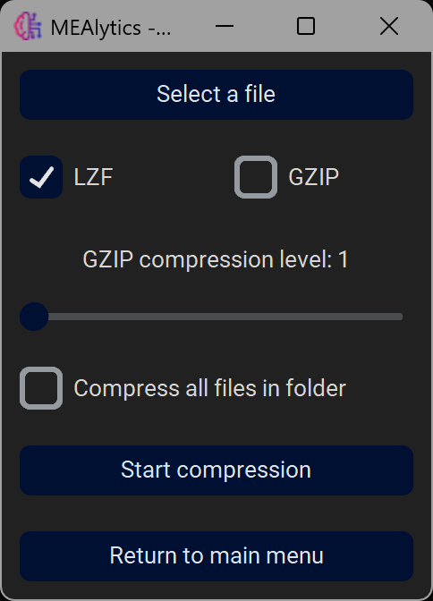

Files that originate from Multichannel Systems MEAs, or files that have been converted from the Axion .raw format are inefficiently chunked. This means that if the application wants to read the data of a single electrode, it must read the data of all electrodes at the same time. If the files are rechunked, this means that single electrode data can be loaded faster, and the analysis can be completed with less RAM use. The application will automatically rechunk files if they are inefficiently chunked, and create a copy. Additionally, compression/rechunking can be performed manually in the GUI.

In the main menu, navigate to **Compress/Rechunk files**. 

 
 
Besides rechunking the data, a compression algorithm will be applied as well. The default is LZF compression, which is not as efficient as GZIP, but achieves the compression in a much faster time. When GZIP is selected, the user can select different compression levels, where higher values will lead to smaller files, but an increased processing time.
By ticking **Compress all files in folder** the application will loop through all files in the parent directory and apply the rechunking and compression.
