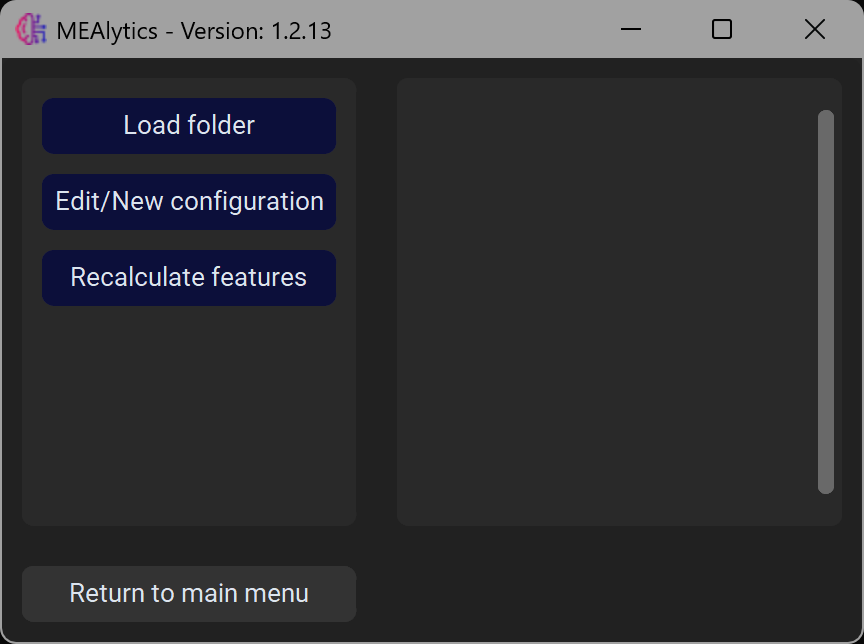
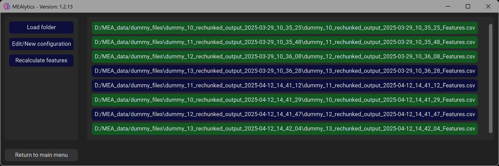
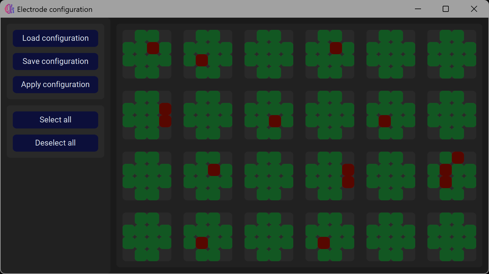

By default MEAlytics averages out single-channel features, such as the amount of spikes, over all electrodes in a well to calculate this feature for a specific well. However, some electrodes might show either very low or very high activity, pulling the well average up/down. MEAlytics includes the option to recalculate the well features, while excluding certain electrodes from the analysis.

First, press **Exclude Electrodes** in the main window. You will be presented with the following window:

This module allows for batch processing. To process multiple experiments, select the parent folder containing the generated outputfolders. The algorithm will recursively look through the subfolders and scan for files ending with "Features.csv".
When selecting multiple experiments, the plate layout (well and electrode number) should be the same for all files.
To process a single file, select the outputfolder generated by the analysis.

The following buttons should appear:

Here it is possible to select which files should be processed by pressing the buttons.

To determine which electrodes should be removed from the analysis, we need to create a new configuration. This can be done by pressing: **Edit/New configuration**
This will create the following window, based on the number of wells/electrodes in your experiments.

Here it is possible to select/deselect specific electrodes. It is also possible to save the current configuration, or load in a previous configuration (given the numbers of wells/electrodes match).
To apply the current configuration, press **Apply configuration**.

To recalculate the features using the current configuration, press **Recalculate features**
The algorithm will recalculate the features from the selected experiments. Previous feature files will be replaced. Additionally, the configuration that was used will be saved in the same folder as "excluded_electrodes.npy". This file can be loaded using the electrode configuration window.

**Removing electrodes from feature calculations will not remove them from network calculations**