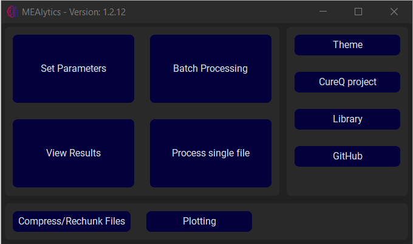
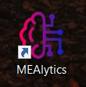

The graphical user interface is the simplest way to communicate with the library. The GUI can be launched in multiple ways:

## Launch from command prompt
Firstly, the GUI can be launched from the command prompt. Simply open the command prompt, and enter “cureq”.

```console
C:\Users>cureq
Successfully launched MEA GUI
```

The output should look like this, and the GUI should appear on your screen.



## Create shortcuts
This process can be simplified by creating shortcuts that in essence perform the same process. In the command prompt, enter “cureq --create-shortcut”.

```console
C:\Users>cureq --create-shortcut
Desktop shortcut created at C:\Users\Desktop\CureQ.lnk
```

The output should look like this, and a shortcut should appear on your desktop:
 


If you are on a Windows machine, the shortcut will also be added to the start menu.
The shortcut can also be added to the taskbar by pressing “Pin to taskbar”.

## Launch from python script
Lastly, the GUI can be launched from a python script. Create a python file and execute the following code:
```python 
from CureQ.GUI.mea_analysis_tool import MEA_GUI

if __name__ == "__main__":
    MEA_GUI()
```
The GUI should always be opened inside the ```if __name__ == '__main__'``` guard. Otherwise, when using multiprocessing, the application will slowly create an infinite amount of processes and crash the application.
