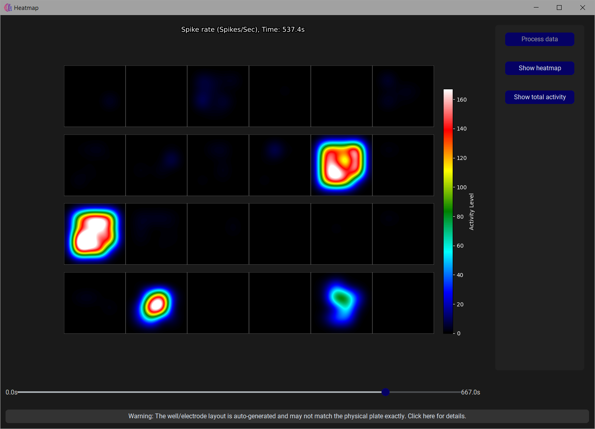
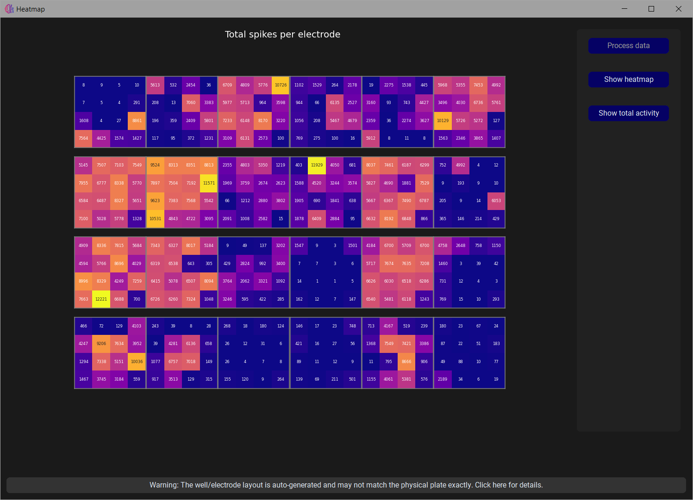

MEAlytics contains a heatmap module designed to provide an intuitive overview of neural activity across the entire MEA plate. It can be accessed as follows:

Similar to the [Inspect results](view_results.md) section, first navigate the the **View Results** module. Here select both the outputfolder generated by the analysis, and the raw data file that was used. Then, navigate to the third tab named **Heatmap** and open a new window for the heatmap using the button that is presented. 
Before accessing the heatmap, the data needs to be processed, this can be initiated with the button **Process data**. After the data has been processed, the heatmap can be shown using **Show heatmap**.

The total spike activity in the individual electrodes can be displayed using **Show total activity**.

