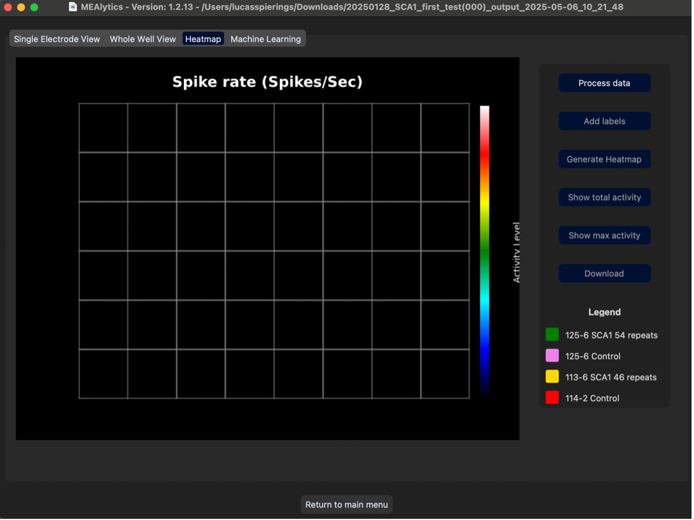

Within the 'View Results' section of the MEAlytics GUI, the third tab is 'Heatmap'.

 

## Buttons

The heatmap contains the following buttons with these functions:

-	Process data: This preprocesses the data and enables all other buttons.
-	Add labels: This button allows the user to add labels to all wells so the user can see easily see which well has which cell culture.
-	Generate Heatmap: This button generates the regular heatmap.
-	Show total activity: This button generates the heatmap showing the total activity of each electrode.
-	Show max activity: This button generates the heatmap showing the maximum per second activity of each electrode.
-	Download: This button downloads the last pressed heatmap. 
-	Back to main menu: This button sends the user back to the main menu of the app.

## Different heatmap examples

The 'regular' heatmap makes an animation, a still frame from it is shown here:
 

The 'total activity' heatmap makes a still image, and an example can be seen here:
 

The 'max activity' heatmap makes a still image, and an example can be seen here:
 
