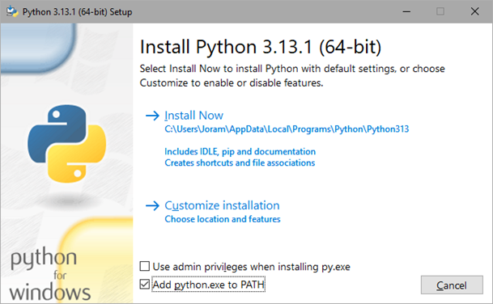

# Installing Python

Since the tool is programmed in python, it is necessary to have python installed in order to run the application. Here, we demonstrate one method to install python on a Windows machine. However there are many (more elaborate) guides available online that should suffice.<br>
<br>
The python interpreter can be installed using the official python installer. All python versions can be found on https://www.python.org/downloads/. The MEA analysis tool has been developed and tested on python 3.11, but will most likely also work on other python 3.* versions.<br>

Download the desired python version, and execute the file you have just downloaded. You will be presented with the following window:<br>
<br>

Select the option **Add python.exe to PATH**. This will allow your operating system to recognise the python installation. Then, press **Install Now**. Finally, let’s confirm that both python and pip are successfully installed by running the following commands in the command prompt.<br>
```console
C:\>python --version
Python 3.11.9

C:\>pip --version
pip 23.3.1
```
If both outputs look like this (it can be different versions) both python and pip have been successfully installed and are recognised by the system.<br>
<br>
# Installing MEAlytics
Once both python and pip have been installed, acquiring the MEA analysis tool should be simple. For the next step we will use pip to install the tool.<br>
First, open the command prompt, then enter:
```console
pip install cureq
```
Pip will now collect the MEAlytics package from the internet, collect and install dependencies and the library. The last few lines should look like this:
```console
Installing collected packages: cureq
Successfully installed cureq-1.1.1
```
The MEA analysis tool is now successfully installed on your machine and can be executed from a python script.

## Add to path
When downloading the MEA analysis tool, the following warning might appear:
```console
WARNING: The script cureq.exe is installed in 'C:\Users\User\AppData\Local\Packages\PythonSoftwareFoundation.Python.3.12_qbz5n2kfra8p0\LocalCache\local-packages\Python312\Scripts' which is not on PATH.
Consider adding this directory to PATH or, if you prefer to supress this warning, use --now-warn-script-location.
```
This usually occurs when python is installed using the Microsoft store. It means that the directory containing python scripts is not added to the PATH environment variable yet. This will mean that the MEAlytics CLI commands will not be able to be executed from the command line. To fix this, the file path will have to be manually added to the environment variables. This can be done using one of the following guides:

- https://stackoverflow.com/questions/44272416/how-to-add-a-folder-to-path-environment-variable-in-windows-10-with-screensho
- https://www.eukhost.com/kb/how-to-add-to-the-path-on-windows-10-and-windows-11/ 

In this example, the folder that should be added to PATH is:
```console
C:\Users\User\AppData\Local\Packages\PythonSoftwareFoundation.Python.3.12_qbz5n2kfra8p0\LocalCache\local-packages\Python312\Scripts
```

## Upgrade Library
MEAlytics might receive further updates to enhance the analysis, or fix problems. To check the current version of the library, open the command prompt, and enter:
```console
C:\> cureq --version    
CureQ MEA analysis tool - Version: 1.2.7
```

The most recent available version of the library can be found on the [pypi page](https://pypi.org/project/CureQ/). The library can be upgraded using the command:
```console
pip install cureq –upgrade
```
This will upgrade the library to the newest available version.

```console
C:\ > pip install cureq --upgrade
Successfully installed cureq-1.2.7
```
