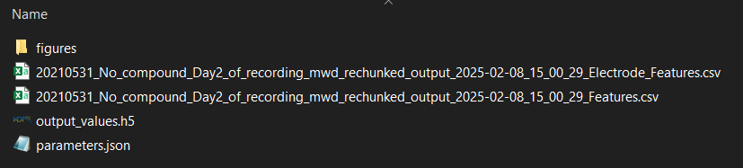

During the analysis, the application will create an “outputfolder” where it stores all results and details from the analysis. This outputfolder can be found in the same location as the raw data file. The outputfolder will share the same name as the raw data file, with the date and time of the analysis attached at the end. The outputfolder contains several files:

**output_values.h5** contain files that are used to save the intermediate results of the spike, burst and network burst detection process. These files are used to calculate the output features and visualise the process in the GUI. These files are generally not important for the end user.

The **Figures** folder contains visualisations for the network burst detection process, and can be used to get a quick overview of network/well activity without having to load in the results in the GUI.

The file ending with **Features.csv** will contain the output features that are calculated by the analysis tool. Here, every column is a feature, and every row is a well. Here all electrode features are averaged out over the well.

The file ending with **Electrode_Features.csv** will contain the single electrode features, such as spike and single channel burst metrics, calculated per individual electrode.

For more information about the features the MEA analysis tool calculates, see Features.

Lastly, the **parameters.json** file contains information about the analysis such as which parameters were used, some information about the dataset, and which version of the tool was used. This file can be used to copy settings from a previous analysis. For more information on how to do this, see [Analyse Single File](analyse_file.html)
