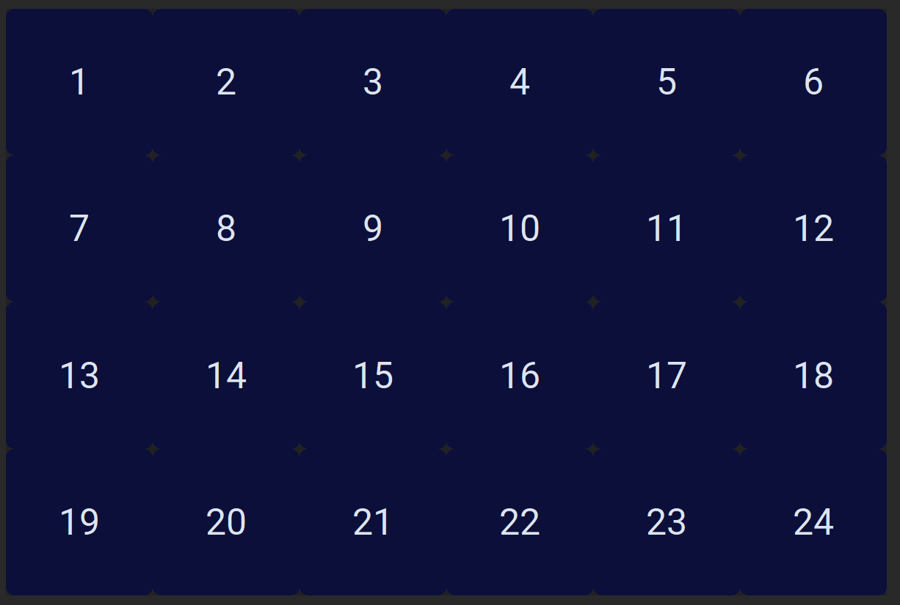
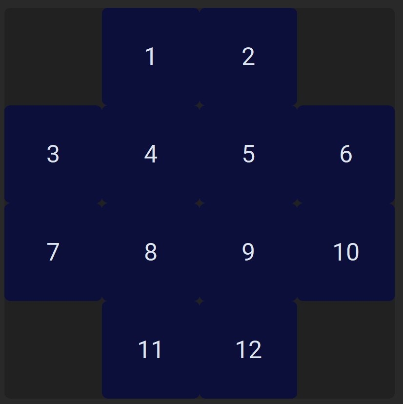

In theory, MEAlytics is able to support every plate type and layout, given that it can be converted to the right format. However, it is important to know how MEAlytics (automatically) handles different well and electrode layouts.

### MEAlytics input
MEAlytics receives the MEA data as a dataset containing a single array for each electrode. For a MEA dataset originating from a 24-well plate with 12 electrodes per well, this would results in a dataset with 288 (12*24) rows, and a column for every voltage readout. MEAlytics also receives the amount of electrode per well, it uses these to determine how many wells a given dataset has, and which electrode belongs to which well. MEAlytics does not receive any other input about the amount of wells.

### Displaying different plate types
#### Displaying wells
When given a certain amount of wells, MEAlytics will automatically calculate the optimal number of rows and columns for this well amount to display the different wells. For example, for a measurement containing 24 wells, the wells will be displayed as follows:

This means that the way that wells are displayed in MEAlytics does not always match how the wells are arranged in the actual plate. However, wells in MEAlytics (and in the output feature files) are always numbered from top left to bottom right (When converted from Axion using our conversion script).

#### Displaying electrodes
Displaying electrodes will follow a similar procedure, where the number of rows an columns to display are automatically determined. MEAlytics does however contain a default configuration for wells containing 12 electrodes. Those electrodes will be displayed as follows:

Where again electrodes are numbered from top left to bottom right (When converted from Axion using our conversion script).