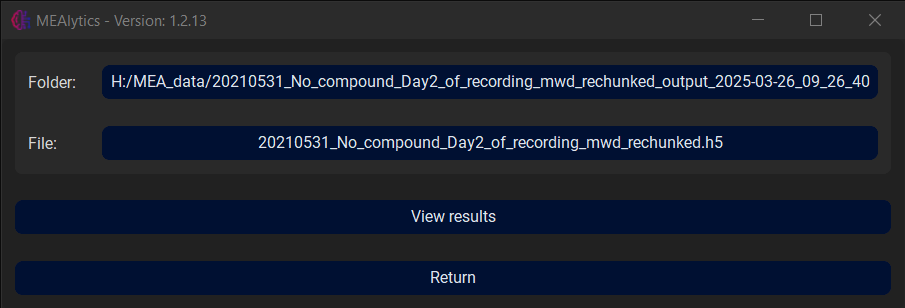
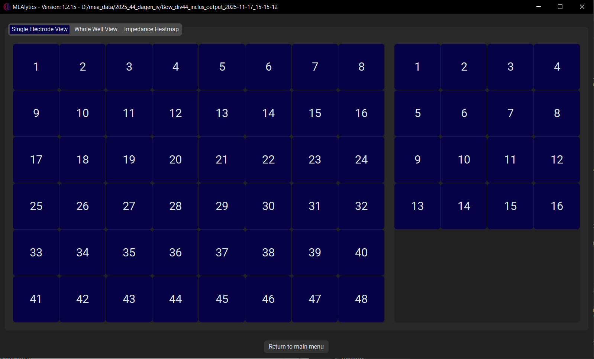
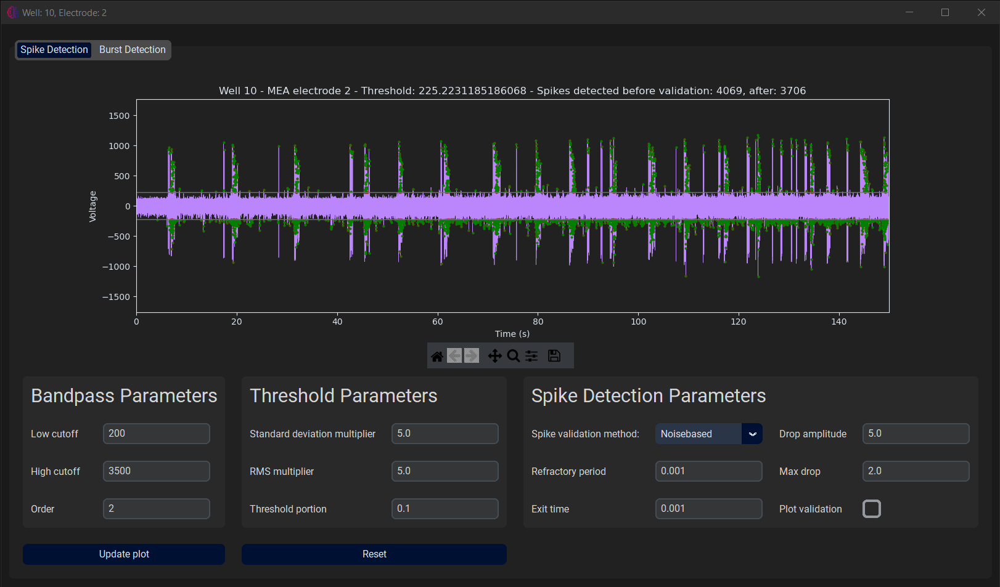
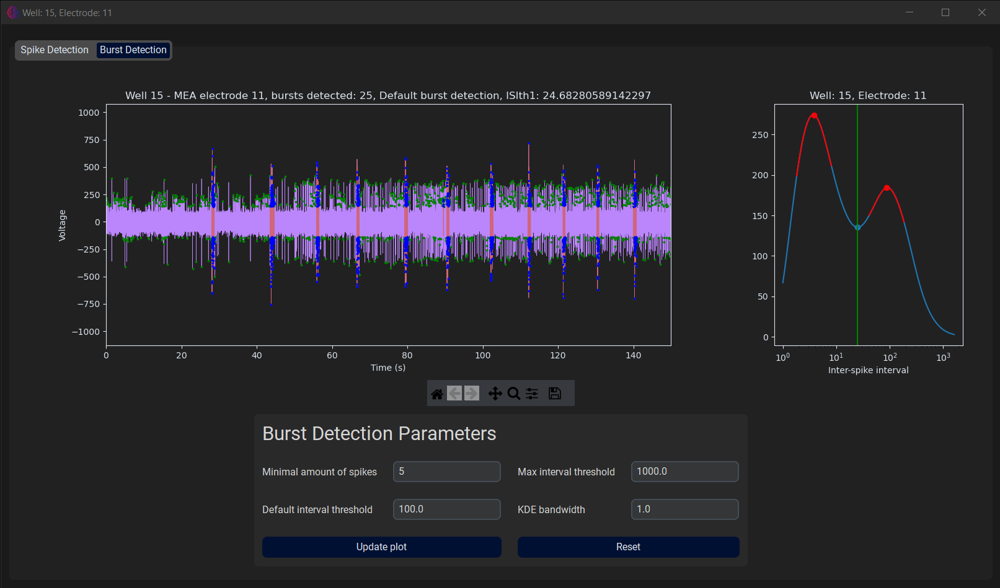
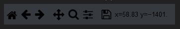
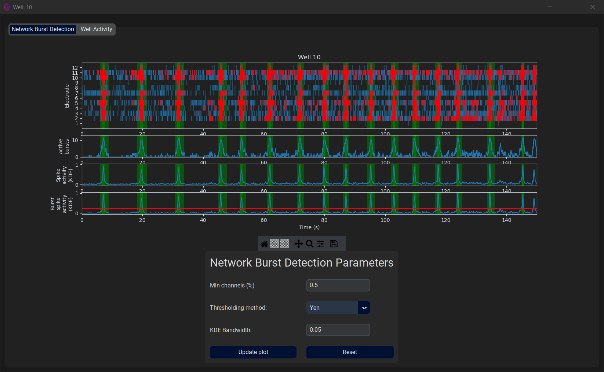
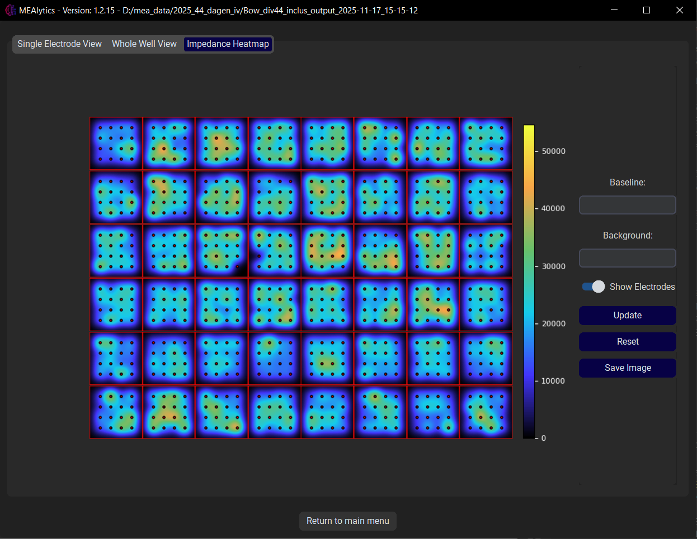

MEAlytics allows the user to inspect the results after the analysis has been completed. In the main menu, select **View Results**.

 

Here, select the output folder that was generated by the analysis. Next, select the raw data file that was used for the experiment. Then press **View Results**.
 
This window contains three tabs, Single Electrode View, Whole Well View and Impedance Heatmap

 

## Single Electrode View

From the Single Electrode View tab, the user can select the desired well and electrode, after which a new window will open.

 
 
Again, this window contains two tabs, **Spike Detection** and **Burst Detection**. The first tab displays the spike detection applied to the raw electrode data. It also contains all the parameters that influence the spike detection. The user can alter these parameters to see how they could affect the analysis. They will not have any effect on the outcomes of the current experiment, or further steps, such as burst or network burst detection.
 
In the second tab, the burst detection is applied to the electrode data is shown, as well as the kernel density estimate that was used to determine the burst detection parameters. Again, the user can change certain parameters to see how they could affect the burst detection process without influencing the outcome of the current experiment.

 

The raw data plot on both tabs is interactive and allows the user to zoom in on the data using the toolbar.

 

## Whole Well View
 
From the Whole Well View tab, the user can select the desired well, after which a new window will open.

 

Here, the user can inspect the network burst detection process on this particular well, and alter parameters to see the effect on the analysis. Again, this will not have any effect on the outcomes of the current experiment.

## Impedance Heatmap

Within the **Impedance Heatmap** tab, a heatmap will be plotted based on the impedance measured before the measurement. The impedance is measured per electrode and can give us information about the amount of cells on or around the electrode. For more information abount the impedance measured by Axion, please check [Axion's page](https://www.axionbiosystems.com/technology/impedance).

Note: This heatmap will only show if the impedance is included in the dataset.

 

On the right side of the heatmap a colorbar is shown, with colors that correspond to impedance-values in **kΩ**.

### Configurations 

Next to the colorbar there is a configuration section. Here the user has a few options:

- **Baseline**: Sets the maximum value of impedance
- **Background**: Sets the minimum value of impedance
- **Show Electrodes**: Toggle the red dots representing electrodes.
- **Update**: Update heatmap using new **Baseline** and or **Background** values.
- **Reset**: Reset the heatmap to original configurations.
- **Save Image**: Save the current heatmap as an image.